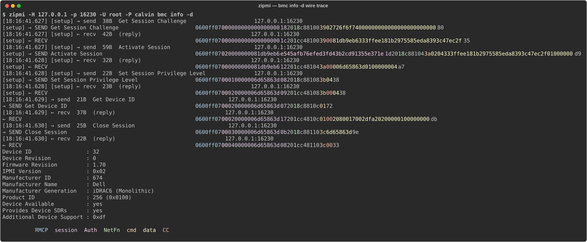

# zipmi

Scapy-based IPMI library, CLI, and virtual BMC for security research.

<details open>
<summary><h2>What</h2></summary>

An ipmitool-like thing that is also a pure-Python IPMI stack built as 
Scapy layers. Lets you dissect, build, fuzz, and replay IPMI traffic with 
full byte-level visibility — every field of every packet is a real Scapy field, 
not an opaque blob.

It's *somewhat* compatible with the basics of `ipmitool` (most definitely not all!),
so things like this should work -
```
# print out the details of the default channel
zipmi -H 10.0.0.1 -U root -P calvin lan print

# some potentially interesting new things
zipmi oem
```
Type "zipmi" or "zipmi --help" for other things it can do.

Note — zipmi defaults to the IPMI 2.0 protocol. The `-I` flag may be used to
specify "lan" to use IPMI 1.5 or "lanplus" for explicitly using 2.0.

### Other components:

- `zipmi.scapy_ipmi` — Scapy `Packet` classes for RMCP, ASF (DSP0136), IPMI 1.5
  session/message, IPMI 2.0 RMCP+, RAKP 1–4, and per-NetFn command payloads.
- `zipmi.scapy_ipmi.oem.{dell, supermicro, idrac9_generated, dell_generated}`
  — vendor OEM dispatch tables ingested from prior firmware RE: 192 Dell
  iDRAC6 entries (full dispatch) + 313 iDRAC9 handlers (name catalog) +
  Supermicro X11 OEM cmd/sub-cmd map + shell-injection attack primitives.
- `zipmi.attacks.dell` — named, callable Dell attack primitives (PROCHOT
  throttle, power cap, sensor threshold tamper, racadm extended config)
  with destructive=True gating.
- `zipmi.core` — high-level `Session` / `Transport` API.
- `zipmi.cli` — `zipmi` command-line tool covering the common ipmitool verbs
  plus extras (`scan`, `dump`, `replay`, `diff`, `oem`, `vbmc`, `fuzz`).
- `zipmi.vbmc` — minimal virtual BMC server that answers IPMI commands. 
- `zipmi.fuzz` — simple fuzzers built on top of the layer hierarchy and the vbmc.
- `zipmi.parsers.{md_table, idrac9_md}` — codegen scripts that ingest
  the BMC research markdown into Python data + markdown docs.

</details>

<details>
<summary><h2>Why</h2></summary>

`freeipmi`/`ipmitool`/`ipmiutil`/etc. are great oracles and much more
expansive in their scope but are a bit opaque/unweildy/difficult to change 
for my research. `pyghmi` is a a wonderful library but its packet format 
lives in hand-rolled bytes.  Neither makes it easy to drop into the middle 
of a session and ask "what does this byte mean?" or "what happens if I 
corrupt field X?". Leveraging scapy helps give various interesting 
capabilities once all the work is done.

</details>

<details>
<summary><h2>Targets</h2></summary>

(From my museum :))

- Dell PowerEdge T710 / iDRAC6 — IPMI 1.5, NetFn 0x30 OEM (Dell IANA 674)
- Supermicro X11SSZ-QF — IPMI 2.0 RMCP+, NetFn 0x30 OEM (SM IANA 10876)
- OpenBMC (Phosphor) romulus / AST2500 — IPMI 2.0 RMCP+ cipher-17 only
  (HMAC-SHA256 / AES-CBC-128). The open BMC stack behind Meta/Google/Intel/
  IBM/Ampere/Nvidia fleets. Nine vendor OEM tables (see OEMs section).

</details>

<details>
<summary><h2>Install</h2></summary>

Recommended — clone, then:

```bash
git clone https://github.com/zenfish/zipmi.git && cd zipmi
make install                 # make dev for editable + dev extras
```

You get **both** the `zipmi` / `bmc-id` commands **and** a working
`import zipmi` in your own scripts (`python myscript.py`, no venv to
activate). The two commands install into the scripts directory of
whichever Python you use — a venv's `bin/`, Homebrew's `bin/` (e.g.
`/opt/homebrew/bin`), or `~/.local/bin` for the per-user fallback. That
directory is already on `$PATH` for a venv or Homebrew's `python3`; for
a `--user` install you may need to add `~/.local/bin` to `$PATH`
yourself. `make install` prints exactly where each command landed and
warns if it isn't on `$PATH`. It runs a normal `pip install .`; if your
Python is "externally-managed" (Homebrew, Debian — PEP 668) and refuses
the global write, it automatically falls back to a per-user install
instead of erroring. Override the interpreter with
`make install PY=python3.12`.

```bash
make                         # (default) build wheel into dist/, NO install
git pull && make install     # update after pulling
make uninstall               # drains every layer (global/--user/pipx)
make clean                   # nuke build cruft AND .venv (keeps .git)
```

Bare `make` only **builds** (sdist + wheel into `dist/`) — it installs
nothing. Use `make install` to actually install.

`make uninstall` reuses the same interpreter, so you never have to
guess which Python the install used.

`make clean` blows away **everything regeneratable** — `build/`,
`dist/`, `*.egg-info`, `__pycache__`, `*.pyc`, tool caches, and
**`.venv`/`venv`**. Only `.git` survives. Rebuild a dev env with
`make dev` afterward. (No venv? Skip `make dev` entirely — `make
install` is venv-free.)

> No `make`? The fallback is just the two lines it wraps:
> `python3 -m pip install .` (add `--user --break-system-packages` if
> the global write is refused) and `python3 -m pip uninstall zipmi`.

<details><summary>Alternative: pipx (CLI only — <code>import zipmi</code> will NOT work)</summary>

```bash
pipx install /path/to/zipmi          # zipmi + bmc-id on PATH, isolated
```

pipx sandboxes the package in its own venv, so the `zipmi`/`bmc-id`
commands work but your own scripts **cannot** `import zipmi` from a
system interpreter. Fine if you only use the CLI; use `./install.sh`
if you write Python against the library.

</details>

### Dev mode (venv-based)

For contributing — runs tests, regenerates docs, exercises hooks:

```bash
python3.11 -m venv .venv && . .venv/bin/activate
pip install -e '.[dev]'
./scripts/install-hooks.sh         # wire pre-commit doc/code symmetry guard
```

> **Heads-up:** if you previously ran `pip install -e .` against a system
> Python (e.g. Homebrew's `/opt/homebrew/bin/python3`), it may have left
> orphan `.pth` + `dist-info` files in that interpreter's `site-packages/`
> plus a stale `zipmi` script in its `bin/`. Clean with:
>
> ```bash
> pip uninstall zipmi   # using the same python that installed it
> # then verify nothing remains:
> find /opt/homebrew/lib/python3.11/site-packages -name 'zipmi*' -o -name '__editable__.zipmi*'
> ```

</details>

<details open>
<summary><h2>Quickstart</h2></summary>

```bash
# for examples below... or use -H/-U/-P/-C flags. Env fallbacks:
# ZIPMI_TARGET (-H), ZIPMI_USER (-U), ZIPMI_PASS (-P), ZIPMI_CIPHER (-C).
# An explicit flag always overrides its env var.
export ZIPMI_TARGET=192.168.0.23 ZIPMI_USER=root ZIPMI_PASS=calvin

# Spec-parity verbs
zipmi mc info
zipmi -I lanplus -C 3 mc info        # IPMI 2.0 RMCP+
zipmi chassis status
zipmi sel list
zipmi sensor list
zipmi user list
zipmi raw 0x06 0x01

# Security probes
zipmi scan asf-ping
zipmi scan auth-caps
zipmi scan cipher-suites             # enumerate advertised RMCP+ ciphers (0x54)
zipmi scan cipher-zero
zipmi user-matrix list               # full user × channel privilege grid (audit)
zipmi user-matrix list --json | jq '.channels'   # machine-readable
zipmi scan all --json                # asf-ping + the full grid, findings on
zipmi fuzz sweep --netfn 0x30 -v     # Dell OEM cmd surface, named

# Sessionless mode — omit -U/-P (and unset ZIPMI_USER/ZIPMI_PASS) and
# every send goes out auth_type=0, session_id=0. The BMC decides what
# to answer. zipmi makes no assumption. (ZIPMI_TARGET is still set, so no -H.)
unset ZIPMI_USER ZIPMI_PASS
zipmi raw 0x06 0x38 0x01 0x04   # Get Chan Auth Caps
zipmi sessionless               # list pre-session cmds

# In-process target for tests / fuzzing / CI
zipmi vbmc serve --vpersona dell_idrac6 --vport 6231 &
zipmi -H 127.0.0.1 -p 6231 mc info
```

</details>

<details>
<summary><h2>zipmi verbs</h2></summary>

Full list of things zipmi understands

```
mc       {info, reset cold|warm, selftest, guid}
chassis  {status, power on|off|cycle|reset|soft --yes,
          identify [secs], bootdev <dev> --yes, bootflags}
sel      {info, list}
sdr      list
sensor   list
lan      print
user     list
user-matrix list [--json] [--all] [--per-priv] [--findings]
                 # full user × channel privilege/auth/cipher grid (read-only)
raw      <netfn> <cmd> [byte ...]
ipmi     [cmd-name [byte ...]]           # standard IPMI cmd by name; no args = list Table G-1
oem      [vendor [cmd-name [byte ...]]]   # OEM cmd dispatcher; no args = list vendors
idrac6      [cmd-name [byte ...]]          # shortcut for `oem idrac6 ...`
idrac9      [cmd-name [byte ...]]          # shortcut for `oem idrac9 ...`
supermicro  [cmd-name [byte ...]]          # shortcut for `oem supermicro ...`
groups   [body [cmd-name [byte ...]]]    # IPMI Group Extension dispatcher (NetFn 0x2C)
dcmi        [cmd-name [byte ...]]          # shortcut for `groups dcmi ...`
scan         {asf-ping, auth-caps, cipher-suites, cipher-zero, all}
sessionless                                # list spec-permitted pre-session cmds
fuzz         {sweep --netfn 0xNN, rakp}
vbmc         serve [--vpersona dell_idrac6|generic] [--vport N]
                                                # see VIRTUAL-BMC.md
```

</details>

<details>
<summary><h2>bmc-id</h2></summary>

`bmc-id` is a standalone, **unauthenticated** BMC identification +
vulnerability probe shipped alongside `zipmi` (installed as its own
`bmc-id` console script). It chains a handful of sessionless IPMI
probes — plus an optional HTTPS/Redfish grab — to fingerprint a BMC's
*real* vendor, generation, firmware revision, and security posture in
roughly four UDP packets. Cheap enough to fan out at scan velocity;
reads targets from argv or stdin and can emit a full report, JSON, or
one TSV line per host.

See **[BMC-ID.md](BMC-ID.md)** for the full writeup — every probe, the
IPMI "tuple" fingerprint, the fleet knowledge-base, confidence
scoring, output modes, and worked examples.

</details>

<details>
<summary><h2>OEMs</h2></summary>

The IPMI specification allows vendors to extend the protocol with a set of reserved
codes. All the vendors - Dell, HP, Supermicro, etc. - use these, but rarely document
them. What follows are some guesses, information gathering, and following the bytes
for a couple of them (from my own Dell and Supermicro servers.)

### OEM discovery and usage

**OEM by name** — instead of `zipmi raw 0x00 0x01`, use the vendor's
own catalogue:

```bash
zipmi oem                                        # list vendors
zipmi idrac6                                      # list iDRAC6's 192 cmds (RE'd from fullfw)
zipmi -H <bmc> dell GetChassisStatus              # run by name (substring match)
zipmi -H <bmc> oem supermicro UtilRestoreConfig   # `oem <vendor>` form

# Multi-word command names MUST be quoted (the shell would otherwise pass
# each word as a separate arg, and the trailing words become data bytes):
export ZIPMI_CIPHER=17     # OpenBMC = cipher 17 only; set once (implies -I lanplus)
zipmi -H <bmc> oem intel "Get BMC Version String"
zipmi -H <bmc> oem intel "Get FW Version Info"

# OpenBMC vendors also answer to ob-<v> / openbmc-<v> to make the namespace
# explicit (the bare short name still works):
zipmi -H <bmc> openbmc-ampere "Get Fan Control Status"
zipmi -H <bmc> ob-google "Sys OEM Command"
```

**Data bytes.** Everything after the command name is the request payload,
sent verbatim — hex (`0x01`), decimal (`1`), space-separated. Whether bytes
are *required* depends on the command: many reads take none
(`Get BMC Version String`), some need a one-byte sub-command or selector,
and writes need structured args. zipmi does NOT synthesize them for you —
it's a raw-data model (same as `zipmi raw`). To know what a given OEM
command expects, read its handler / the per-command notes; the OpenBMC
OEM IPMI survey (upstream source review) documents the byte
layouts that were recovered from source. A wrong-length payload comes back
as a completion code (e.g. `0xC7` Request Data Length Invalid), not a crash.

> **zipmi defaults to IPMI 2.0 RMCP+ (`-I lanplus`), cipher auto-discovered.**
> The right default: nearly every BMC from the last ~15 years speaks 2.0,
> OpenBMC is 2.0-only, and 2.0 encrypts the session. Pass `-I lan` only for a
> legacy 1.5-only BMC. (Older zipmi defaulted to 1.5 `-I lan`; changed 2026-08.)
>
> **OpenBMC speaks only IPMI 2.0 (RMCP+).** It does NOT answer IPMI 1.5 at all —
> a 1.5 request (`-I lan`) is silently dropped and you get a **timeout, not an
> error**. With the 2.0 default you no longer need `-C 17`; the cipher is
> auto-discovered (OpenBMC offers only suite 17 = HMAC-SHA256 / AES-CBC-128).
> Once you have a valid session, an unimplemented command returns a real
> completion code (`0xC1` Invalid Command) — the timeout-vs-0xC1 distinction
> tells you "wrong protocol/session" vs "command not supported".

The standard IPMI 2.0 set has the same by-name UX — `zipmi ipmi`
lists Table G-1, `zipmi -H <bmc> ipmi "Get Channel Authentication
Capabilities" 0x01 0x04` resolves the name and sends the bytes you
supply (same raw-data model as `raw`/`oem`).

Names are case-insensitive and tolerate hyphens/underscores; the
`Cmd`/`OEM`/`Dell` prefixes are stripped before matching. Multiple
matches print the candidate list and exit non-zero; no host is needed
for the listing forms.

The catalogue header reports two numbers:

```
idrac6      IANA 674     192 cmds
idrac9      IANA 674     46 named / 271 known
supermicro  IANA 10876   65 cmds
```

`N named / M known` means M `(NetFn, cmd)` dispatch slots have been
recovered (from binary RE / vendor docs) but only N cross-reference to
a human-readable handler name — the rest are runtime-bound stubs that
appear in the listing as `(unnamed: ...)` with their originating
dispatch-table name in the description so you can still send raw
bytes via `zipmi raw`.

Source-of-truth (hahah... well, for some value of truth) per vendor:

- **idrac6**: handler symbols recovered from `T710-bmc/bin/fullfw`
  with radare2 auto-analysis (ARM debug-string residue carried function
  names through the strip). 195 of 213 dispatch slots are now named.
  See `zipmi/scapy_ipmi/oem/dell_binary_names.py`. The MD-derived
  fallback at `dell_generated.py` is kept for privilege/description
  metadata. Resolution order in `DELL_CMD_NAMES`: hand-curated
  `DELL_NAME_OVERRIDES` → binary-RE'd `DELL_BINARY_NAMES` → MD-derived
  `DELL_NAMES`.
- **idrac9**: **277 named** (46 from upstream RE doc + 99 from dynsym
  addr resolution + 132 from R_ARM_GLOB_DAT runtime-dispatch
  extraction). The catalogue surfaces 349 known dispatch slots: 271
  static (from binary RE of the lib dispatch tables) plus 78
  runtime-only (handler-pointer relocations in lib data sections that
  aren't in any static dispatch but get registered at boot).
  Resolution layers:
  1. **Static dispatch + addr resolution**: the 271 static entries
     with `handler_addr` ≠ 0 — the address points into a lib's `.text`
     and the dynsym `DF .text` exports name it. 145 hits.
  2. **R_ARM_GLOB_DAT runtime dispatch**: every `*.so.9.9.9` lib has
     dispatch slots in `.data` whose handler-pointer slot is a
     relocation. Pair the descriptor (4B before each reloc) with the
     symbol from the reloc to recover (NetFn, cmd) → handler. 132 hits
     (54 of which fill in static-dispatch slots that had
     `handler_addr=0x00000000`; the remaining 78 are runtime-only
     additions not present in any static table).
  3. Remaining 72 slots have neither a static address nor a
     relocation; the init agent must register them at boot via paths
     not visible to static analysis. They keep their dispatch-table
     tag (DCMI / OEMIPMI / OSAOEM) so they remain fuzzing targets.

  Reference dumps (iDRAC9 firmware reverse-engineering notes): `idrac9_addr_map.json`
  (3235 dynsym entries), `idrac9_resolution_report.md` (per-entry
  addr-resolution breakdown), `idrac9_runtime_dispatch.json` (211
  R_ARM_GLOB_DAT pairs across libs), `idrac9_runtime_dispatch_report.md`.
  Regenerate via `build_idrac9_addr_map.py` and
  `extract_runtime_dispatch.py`.
- **supermicro**: 422 cmds total. Two layers:
  1. **smcipmi RE work** (4 top + 61 sub-cmds) — original handler
     names with HIGH RISK / CRITICAL annotations on the path-traversal
     and shell-injection sites (`UtilRestoreConfig`, `OEMFlashFWCmd`,
     etc.) plus the ATEN AlUpdate firmware-exfil sequence at
     NetFn 0x3e cmds 0x1d/0x1e/0x1f.
  2. **SMCIPMITool 2.30.0 decompile overlay**
     (`supermicro_smcipmi_names.py`) — 153 OEM (NetFn, cmd) +
     226 sub-cmds harvested by walking every
     `setCommandAndData((byte)NetFn<<2, (byte)Cmd, ...)` call site in
     the decompiled `com/supermicro/ipmi/*.class` Java sources. Adds
     full coverage of NetFn 0x32 flash ops (read / write / erase /
     activate flash mode), NetFn 0x2e Intel Node Manager (40+ cmds),
     NetFn 0x30 0x32 InfiniBand control, and a long tail of
     manufacturing/diagnostic cmds. Sub-cmds dispatched via 1st data
     byte; zipmi prepends it on `<verb-name>` resolution.
- **OpenBMC** (open source — no firmware RE needed): nine vendor flavors
  catalogued straight from the upstream provider repos. Unlike a single
  proprietary BMC, OpenBMC spans many vendor IANAs and reuses the raw
  vendor NetFns 0x30..0x3E, so the **same `(NetFn, cmd)` means different
  things per vendor** — load exactly the vendor you target.

  | vendor | IANA | NetFns | provider repo |
  |--------|------|--------|---------------|
  | `intel` | 343 | 0x30/0x32/0x3E + fw 0x08 | intel-ipmi-oem |
  | `facebook` (`meta`) | 4337¹ | 0x30/0x36/0x38 + BIC | fb-ipmi-oem |
  | `google` | 11129 | 0x2E + IANA, sub-cmds | google-ipmi-sys |
  | `ampere` | 40981 | 0x3C (ARM) | ampere-ipmi-oem |
  | `openpower` (`ibm`) | 2 | 0x32/0x3A | openpower-host-ipmi-oem |
  | `inspur` | 37945¹ | 0x3C | inspur-ipmi-oem |
  | `foxconn` | — | 0x34 | foxconn-ipmi-oem |
  | `wistron` | — | 0x30 | wistron-ipmi-oem |
  | `nvidia` | — | group 0x3C / NetFn 0x2C | phosphor-host-ipmid oem/nvidia |

  ¹ informational; NOT on the wire (raw vendor NetFns carry no IANA — only
  Google uses the real NetFn 0x2E + IANA group form). `zipmi.load_vendor("openbmc")`
  loads all nine at once (for pcap dissection); the manifest lives at
  `zipmi/scapy_ipmi/oem/openbmc.py` and adding a vendor is one `oem/<v>.py`
  module + one manifest row. Full source catalogue + per-cmd security notes:
  OpenBMC OEM IPMI survey (upstream source review).

  **Note on OpenBMC RMCP+:** OpenBMC commonly offers **only cipher suite 17**
  (HMAC-SHA256 / SHA256-128 / AES-CBC-128) — use `-C 17`. Its Get Device ID
  advertises manufacturer-id 0 ("Unknown"), so IPMI alone won't tell you the
  vendor; fingerprint over Redfish (`GET /redfish/v1/Managers/bmc` → a manager
  named `bmc` with `Oem.OpenBmc`). See the OpenBMC OEM IPMI survey (upstream source review) for the live
  romulus walkthrough and the internet-survey prevalence study.

### IANA: why each vendor has a number

OEM NetFns (0x2E, 0x30..0x3E) are a private namespace **per vendor**.
The same `(NetFn 0x30, cmd 0xC0)` means PROCHOT throttle on Dell, an
unrelated cmd on Supermicro, and something else again on HP. Without
knowing whose namespace you're in, OEM cmds are ambiguous garbage.

The disambiguator is the IANA **Private Enterprise Number** — a
unique integer the IANA registry hands out to organisations
(https://www.iana.org/assignments/enterprise-numbers/). Dell = 674,
Supermicro = 10876, HPE = 11, Intel = 343, IBM = 2.

</details>

<details>
<summary><h2>Group Extension cmds (DCMI, PICMG, HPM, ...)</h2></summary>

Standardised cmds that ride NetFn 0x2C/0x2D with a *group code* as
the first data byte (0xDC=DCMI, 0x00=PICMG, 0x03=VITA, 0x04=HPM).
Different namespace from OEM — same UX:

```bash
zipmi groups                            # list group bodies
zipmi dcmi                              # list DCMI's 15 cmds
zipmi -H <bmc> dcmi GetPowerReading 0x01 0x00 0x00
zipmi -H <bmc> groups dcmi GetCapabilities
```

zipmi prepends the group-code byte automatically; supply only the
cmd-specific bytes after. The wire-trace label shows the body-aware
name (e.g. `DCMI Get Power Reading` instead of generic `NetFn 0x2c
cmd 0x02`).

Currently implemented: **DCMI 1.5** (15 cmds, source: Intel/DMTF spec
Table 6-1). PICMG / HPM / VITA wired as future entries in
`zipmi/scapy_ipmi/groups/`.

A target advertises its IANA in three places on the wire, all
parseable without authentication:

- **`Get Device ID` response** (App 0x06 cmd 0x01) — bytes 6-8 are
  the 3-byte little-endian Manufacturer ID. First thing to check on
  any BMC. (`zipmi mc info` prints it.)
- **ASF Pong** (RMCP class 0x06) — `OEM IANA` field in the reply.
  Sessionless, runs on a closed network. (`zipmi scan asf-ping` prints
  it.)
- **IPMI 2.0 OEM payload type / OEM Group cmds** — IANA carried in
  the payload itself.

Workflow: probe the target → read IANA → pick the matching
`zipmi <vendor>` to get cmd names. The IANA column in `zipmi oem` is
documentation — it tells you which probed value should pick that
vendor's table. (Note iDRAC9 reuses Dell's 674; `load_vendor("idrac9")`
overlays iDRAC9-specific names onto the iDRAC6 base.)

Common flags: `-H -p -U -P -A {none,password,md5} -I {lan,lanplus} -C N -t T`,
or set `ZIPMI_TARGET / ZIPMI_USER / ZIPMI_PASS` env vars.

**Credentials are not assumed.** Pass `-U` and `-P` (or set both env
vars) to authenticate. Pass neither and zipmi sends every request
sessionless — `auth_type=0`, `session_id=0`, no handshake. The BMC
decides whether to answer. Mixed (one flag without the other) is an
error. `zipmi sessionless` lists the commands the IPMI 2.0 spec
permits outside a session.

**Wire trace** — every verb that talks to a BMC accepts:
- `-v` / `--verbose` — timestamped human-readable event log:
  `→ send NNN B  Get Device ID  192.168.0.23:623`, `← recv …`,
  `!! timeout after 3.0s`. Session-setup events are tagged `[setup]`.
- `-d` / `--debug` — everything `-v` shows PLUS a hex dump of every
  packet (work + setup).

Each event line carries the IPMI Table G-1 command name (or the
RAKP/OpenSession payload type, or the ASF message type). OEM commands
(NetFn 0x2E and 0x30..0x3E) are prefixed `[OEM]`. The `← recv` line
omits the name — it is always the immediate reply to the `→ send`
above.

The hex column is colour-coded by ColorBrewer palette: RMCP header,
session header, AuthCode, IPMB framing, NetFn, cmd / payload-type,
data, and the completion-code byte of every response each get their
own colour. Colour is on by default when stdout is a TTY.

[](docs/img/wire-trace.svg?raw=true)

Three palettes ship; pick one with `--palette`:

- `auto` (default) — detects terminal background, picks pastel for
  dark, set for light. Detection uses `COLORFGBG` if set, otherwise an
  OSC 11 query (100 ms timeout); falls back to pastel if neither
  responds.
- `pastel` — ColorBrewer Pastel1, soft pastels, dark terminals
- `set`    — ColorBrewer Set1, saturated, light terminals
- `dark`   — ColorBrewer Dark2, muted dark, dark terminals

Single-letter forms accepted: `-p a` / `-p p` / `-p s` / `-p d`.
Disable colour entirely with `-n` / `--no-color` or `NO_COLOR=1`
(https://no-color.org). Force it *on* off a TTY (e.g. capturing the
trace into a pipe) with `FORCE_COLOR=1` or `CLICOLOR_FORCE=1`.

Palette + role mapping live in a single `COLOR CONFIG` block at the
top of `zipmi/scapy_ipmi/colorize.py`. Add a new palette by appending
to the `PALETTES` dict; remap which field gets which colour by editing
the per-palette role dict.

In fuzz verbs the same flags additionally enable streaming output
(rows print as each probe lands).

</details>

<details>
<summary><h2>Repo Layout</h2></summary>

```
zipmi/scapy_ipmi/  — Scapy layers (rmcp, asf, ipmi15, ipmi20, rakp, oem/, ...)
zipmi/core.py      — Session / Transport
zipmi/cli/         — argparse CLI
zipmi/vbmc/        — virtual BMC server
zipmi/fuzz/        — fuzzers (Phase 6)
examples/          — runnable demos
tests/             — unit + integration + golden pcap diffs
docs/              — architecture, ipmi notes, fuzzing, vbmc
```

</details>

<details>
<summary><h2>Status</h2></summary>

**Phases 0–14 done.** 130/130 tests pass. Live-verified against Dell iDRAC6
1.70: `mc info`, `chassis status`, `sel list`, `sdr list`, `sensor list`,
`lan print`, `user list`, `chassis bootflags`, `raw`,
`sol {info, baud, payload, set, activate, deactivate, looptest, autobaud}`,
`scan {asf-ping, auth-caps, cipher-suites, cipher-zero}`, `fuzz sweep`, plus full RMCP+ /
RAKP / cipher 3 lanplus session (incl. SOL payload type 1 over the encrypted
session). 192 Dell OEM dispatch entries auto-loaded
from `fullfw-ipmi-commands.md`; 313 iDRAC9 handler names from rootfs `.so`
catalog **plus 271 (NetFn, cmd, priv) tuples from static dispatch-table
extraction**; 11 static + 2 factory Dell attack primitives in
`attacks/dell.py`.

See `docs/STATUS.md` for the per-commit phase log, `docs/command-table.md`
for spec coverage, `docs/dell-command-table.md` for the full Dell iDRAC6
dispatch surface (192 entries), `docs/idrac9-command-table.md` for the
iDRAC9 handler catalog (313 entries), `docs/attacks-dell.md` for the
attack primitives catalog, `docs/bmc-generations.md` for the
`Manufacturer Generation` heuristic (Dell product-ID → iDRAC6/8/9
mapping, monolithic vs modular split), `docs/fuzz.md` for the
fuzzer inventory (sweep, rakp, length, cipher), `docs/fuzz-sweep.md`
for the verbosity / bucket / skip-list details of `fuzz sweep`, and
`docs/tutorial.md` for a Scapy-style REPL walkthrough, and
`docs/i2c-master-write-read.md` for the `i2c`/`i2cscan`/`i2c-id` feature
(I2C over IPMI Master Write-Read) with the in-session-vs-loop timing, and
`docs/firmware-firewall.md` for the `firewall` verb (IPMI §21 command-surface
discovery — exposed / lockable / disabled).

</details>

# License

MIT. No third-party code is included or vendored. zipmi's wire code is its own,
built from the IPMI/DCMI/ASF specifications and cross-checked against reference
tools. See [docs/Bibliography.md](docs/Bibliography.md) for the specs, tools,
libraries, and research it leaned on (IPMI 2.0/1.5, DCMI, ipmitool, FreeIPMI,
Scapy, pyghmi, OpenBMC, and more), each with a URL.
